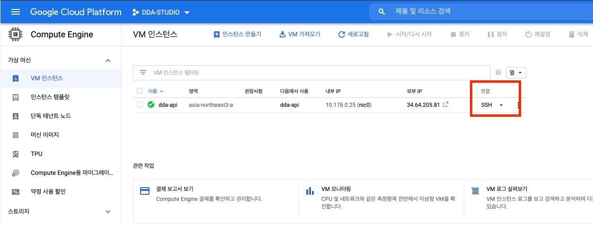
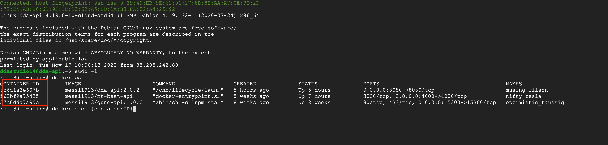
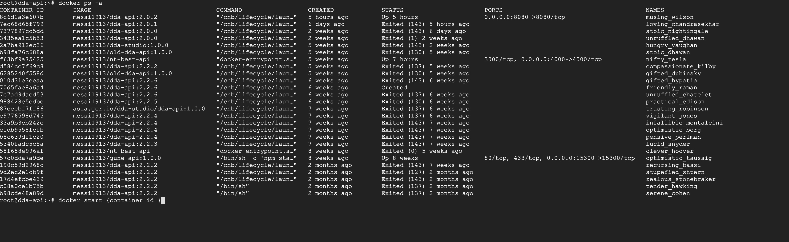

# dda-studio
dda studio 통합서버

## 서버 재기동 방법
1. [GCP](https://console.cloud.google.com/compute/instances?hl=ko&project=dda-studio&instancessize=50, "Google Cloud Platform") 에 접속한다. 
( ID / PW 입력 )

2. SSH 접속

3. Running 중인 Docker 재시작
   
    1) sudo -i 
    2) docker ps (구동중인 도커 확인)
    3) docker stop {containerid} (docker ps 시 가장 왼쪽)
    4) docker start {containerid} ( 동일한 컨테이너 ID ) 

4. Terminated 된 Docker 재시작
   
    1) sudo -i
    2) docker ps -a ( 이때까지 구동한 모든 도커 컨테이너 )
    3) docker start {containerid} (이중에 구동하고 싶은거 찾아서 구동) 
